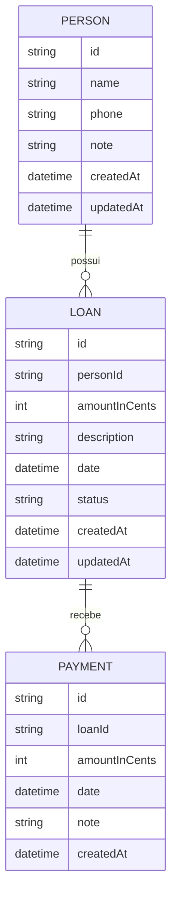

# 03 — Modelo de Domínio

## Visão geral das entidades

O domínio do Nexum é intencionalmente enxuto: **três entidades**, sem entidades auxiliares (sem categorias, tags, moedas, taxas, ou usuários). Isso é uma decisão deliberada de simplicidade (ver `06-decisoes.md`).

---

## Entidade: Person

Representa alguém a quem o usuário emprestou (ou pode emprestar) dinheiro.

### Atributos

| Atributo | Tipo | Obrigatório | Descrição |
| --------- | ---- | ----------- | --------- |
| id | string (UUID) | Sim | Identificador único. |
| name | string | Sim | Nome da pessoa. Não pode ser vazio. |
| phone | string | Não | Contato opcional, sem validação rígida de formato no MVP. |
| note | string | Não | Anotação livre sobre a pessoa. |
| createdAt | datetime | Sim | Timestamp de criação, gerado pelo sistema. |
| updatedAt | datetime | Sim | Timestamp da última edição, gerado pelo sistema. |

### Regras da entidade

- `name` não pode ser vazio nem conter apenas espaços em branco.
- Não há restrição de nome duplicado (podem existir duas pessoas com o mesmo nome — o app não assume nome como identificador de negócio).
- Uma pessoa é um agregador de empréstimos: não possui saldo próprio armazenado — o "saldo devedor da pessoa" é **sempre calculado** como a soma dos saldos devedores de seus empréstimos ativos.
- Exclusão de pessoa com empréstimos ativos exige confirmação explícita (ver RN10).

---

## Entidade: Loan

Representa um valor emprestado pelo usuário a uma pessoa, em uma data específica.

### Atributos

| Atributo | Tipo | Obrigatório | Descrição |
| --------- | ---- | ----------- | --------- |
| id | string (UUID) | Sim | Identificador único. |
| personId | string (FK) | Sim | Referência à pessoa dona do empréstimo. |
| amountInCents | int | Sim | Valor original emprestado, armazenado em centavos (inteiro). |
| description | string | Não | Motivo/observação livre (ex.: "empréstimo para conserto do carro"). |
| date | datetime | Sim | Data em que o empréstimo foi concedido. |
| status | enum (`active`, `paid`) | Sim | Derivado do saldo devedor, mas persistido para consultas rápidas (ver `09-banco.md`). |
| createdAt | datetime | Sim | Timestamp de criação. |
| updatedAt | datetime | Sim | Timestamp da última modificação (inclui mudanças de status). |

### Campo calculado (não persistido como fonte de verdade)

- **outstandingBalance** = `amountInCents - sum(payments.amountInCents)`
  - Recalculado sempre que um pagamento é criado, editado ou excluído.
  - O `status` é apenas um cache de leitura desse cálculo (ver `09-banco.md` para estratégia de sincronização desse cache).

### Regras da entidade

- `amountInCents` deve ser maior que zero.
- Um empréstimo pertence a exatamente uma pessoa (RN01).
- O valor original (`amountInCents`) não pode ser editado se já existir pelo menos um pagamento associado (RN09) — evita inconsistência retroativa no histórico.
- Excluir um empréstimo exclui em cascata todos os seus pagamentos (RN11).
- `status = paid` quando `outstandingBalance = 0`; `status = active` quando `outstandingBalance > 0`.

---

## Entidade: Payment

Representa um valor pago pela pessoa devedora, parcial ou total, referente a um empréstimo específico.

### Atributos

| Atributo | Tipo | Obrigatório | Descrição |
| --------- | ---- | ----------- | --------- |
| id | string (UUID) | Sim | Identificador único. |
| loanId | string (FK) | Sim | Referência ao empréstimo ao qual pertence. |
| amountInCents | int | Sim | Valor pago, em centavos. |
| date | datetime | Sim | Data em que o pagamento ocorreu. |
| note | string | Não | Anotação livre (ex.: "pago via Pix"). |
| createdAt | datetime | Sim | Timestamp de criação. |

### Regras da entidade

- `amountInCents` deve ser maior que zero (RN06).
- A soma de todos os pagamentos de um empréstimo nunca pode exceder o `amountInCents` do empréstimo (RN07).
- Um pagamento pertence a exatamente um empréstimo (RN02).
- Pagamentos são imutáveis quanto ao empréstimo de origem (não é possível "mover" um pagamento para outro empréstimo).
- Um pagamento pode ser excluído; ao ser excluído, o saldo devedor e o status do empréstimo são recalculados imediatamente (RN12).

---

## Relacionamentos

| Relação | Cardinalidade | Descrição |
| -------- | ------------- | --------- |
| Person → Loan | 1:N | Uma pessoa pode ter vários empréstimos; um empréstimo pertence a uma única pessoa. |
| Loan → Payment | 1:N | Um empréstimo pode ter vários pagamentos; um pagamento pertence a um único empréstimo. |

Não há relacionamento N:N em nenhum ponto do domínio — decisão deliberada para manter as consultas e a modelagem simples (ver `06-decisoes.md`).

## Invariantes globais do domínio

1. `sum(payments de um empréstimo) <= amountInCents desse empréstimo` — sempre.
2. `outstandingBalance >= 0` — sempre.
3. Toda entidade excluída remove (em cascata) suas entidades filhas diretas.
4. Todo valor monetário é um inteiro em centavos — nunca ponto flutuante.