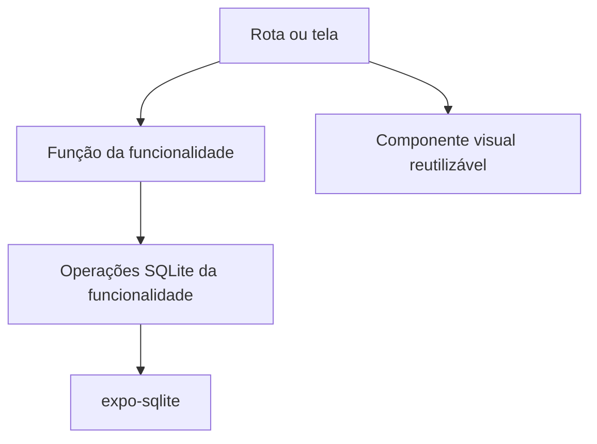

# 04 — Arquitetura

## Visão geral

Nexum é desenvolvido em **React Native com Expo e TypeScript**, usando o **Expo Go** durante o desenvolvimento inicial. A organização prioriza um fluxo fácil de acompanhar e cria abstrações somente quando uma necessidade concreta aparece.



| Área | Responsabilidade |
|---|---|
| **App** | Rotas, layouts e estado local das telas. |
| **Components** | Elementos visuais reutilizáveis por mais de uma tela ou layout. |
| **Features** | Tipos, validações, ações e persistência de cada funcionalidade. |
| **Database** | Inicialização da conexão, schema e migrations gerais. |
| **Arquivos globais** | Tema e utilitários realmente compartilhados, como valores monetários. |

O objetivo não é manter cada responsabilidade em uma camada própria. O objetivo é conseguir seguir o caminho entre uma ação da tela e sua persistência sem atravessar arquivos que apenas repassam chamadas.

## Stack técnica

| Área | Escolha |
|---|---|
| Framework mobile | React Native gerenciado pelo Expo |
| Linguagem | TypeScript em modo estrito |
| Ambiente inicial | Expo Go |
| Navegação | Expo Router |
| Persistência | `expo-sqlite` |
| Estado de UI | Hooks locais do React |
| Testes | Jest, `jest-expo` e React Native Testing Library |
| Build Android | EAS Build |

Dependências do Expo devem ser instaladas pelo comando recomendado pelo framework para evitar incompatibilidades. Uma biblioteca de estado global só deve ser adicionada quando existir estado realmente compartilhado que não possa ser mantido de forma clara nas telas.

## Limite de compatibilidade com Expo Go

Durante o MVP:

- só podem ser adotadas bibliotecas incluídas no Expo SDK ou implementadas apenas em JavaScript/TypeScript;
- não haverá edição manual de código nativo nem manutenção das pastas `android/` e `ios/`;
- toda nova dependência deve ser verificada quanto à compatibilidade com o Expo Go antes de entrar no projeto;
- uma necessidade que exija código nativo ausente no Expo Go demanda uma nova decisão arquitetural.

O Expo Go é o cliente de desenvolvimento, não o artefato distribuído ao usuário. Builds instaláveis e de produção serão gerados com EAS Build.

## Organização de pastas

```text
src/
├── app/                         # rotas e layouts do Expo Router
│   ├── _layout.tsx
│   └── (tabs)/
├── components/                  # componentes visuais reutilizáveis
│   └── FooterNavigator.tsx
├── database/                    # configuração geral do SQLite
│   ├── connection.ts
│   ├── migrations/
│   └── schema.ts
├── features/                    # funcionalidades que já existem
│   └── people/
│       ├── people.ts            # tipos, validações e ações públicas
│       └── people-database.ts   # consultas e comandos SQL
├── money.ts                     # valores monetários compartilhados
└── theme.ts                     # cores, tipografia e espaçamento
```

Pastas e arquivos não devem ser criados para funcionalidades futuras. Quando empréstimos e pagamentos começarem a ser implementados, cada um recebe sua pasta em `features/` somente se precisar de regras ou persistência próprias.

## Navegação

O Expo Router oferece roteamento baseado em arquivos. A navegação principal possui quatro abas persistentes no rodapé:

| Aba | Arquivo de rota | Caminho |
|---|---|---|
| Início | `src/app/(tabs)/index.tsx` | `/` |
| Pessoas | `src/app/(tabs)/pessoas.tsx` | `/pessoas` |
| Ativos | `src/app/(tabs)/ativos.tsx` | `/ativos` |
| Quitados | `src/app/(tabs)/quitados.tsx` | `/quitados` |

O layout `src/app/(tabs)/_layout.tsx` registra as rotas, define títulos e ícones e entrega as propriedades de navegação ao `src/components/FooterNavigator.tsx`. O footer controla somente a aparência e a interação dos botões; cada arquivo em `(tabs)` controla o conteúdo da aba correspondente.

Telas secundárias, como detalhe e formulário, usam navegação em pilha sobre o layout das abas. Ao voltar, o usuário retorna para a aba de origem.

## Estado da interface

Estado temporário pertence à tela ou ao componente que o utiliza:

- `useState` para campos, filtros, carregamento e mensagens de erro;
- `useEffect` para carregar dados quando a tela precisar;
- valores calculados diretamente durante a renderização ou com `useMemo` quando houver custo relevante.

Context ou biblioteca de estado global não devem ser adicionados apenas para antecipar compartilhamento futuro. Caso duas telas passem a precisar do mesmo estado em memória, a necessidade deve ser reavaliada com exemplos concretos antes de escolher uma solução.

## Funcionalidades e persistência

Cada pasta em `features/` expõe as operações que a tela pode executar. Na funcionalidade de pessoas:

- `people.ts` define `Person`, entradas, resultados, validações e funções como `listPeople`, `createPerson`, `updatePerson` e `deletePerson`;
- `people-database.ts` contém SQL, conversão de linhas e consultas auxiliares;
- a tela obtém a conexão usando `useSQLiteContext()` e chama a função pública necessária.

Exemplo de fluxo:

```text
PeopleRoute
  → listPeople(database)
    → listPersonRows(database)
      → SQLite
```

O arquivo de SQL não contém estado visual. A tela não escreve SQL diretamente. Essa divisão mantém duas responsabilidades concretas sem introduzir interfaces, classes ou Providers intermediários.

## Banco de dados

`expo-sqlite` mantém os dados entre reinicializações e oferece transações e integridade relacional. O `SQLiteProvider`, em `src/app/_layout.tsx`, inicializa a conexão e executa as migrations antes de liberar o aplicativo.

Operações compostas, como pagamento com atualização de status, devem permanecer atômicas. Foreign keys são habilitadas na inicialização, migrations são versionadas e os detalhes do schema ficam em `09-banco.md`.

## Práticas mantidas

| Prática | Aplicação |
|---|---|
| TypeScript estrito | Detecta incompatibilidades de tipos durante o desenvolvimento. |
| `Money` | Mantém valores inteiros em centavos e centraliza formatação monetária. |
| Resultados discriminados | Representam sucesso e falhas esperadas de validação. |
| Migrations versionadas | Permitem evoluir o schema sem apagar dados existentes. |
| Funções pequenas | Tornam explícito o caminho entre regra e persistência. |

## Regras de organização

1. Rotas e layouts ficam em `src/app/` porque o Expo Router depende dessa convenção.
2. Componentes vão para `src/components/` quando forem reutilizados ou fizerem parte da estrutura visual global.
3. Código específico de uma funcionalidade fica junto em `src/features/<nome>/`.
4. SQL específico de uma funcionalidade fica no arquivo `<nome>-database.ts` dessa funcionalidade.
5. Configuração geral do SQLite fica em `src/database/`.
6. Novas abstrações e pastas exigem um uso concreto no código atual.

## Referências oficiais

- [Expo Router](https://docs.expo.dev/router/introduction/)
- [Compatibilidade e limites do Expo Go](https://docs.expo.dev/develop/development-builds/introduction/)
- [`expo-sqlite`](https://docs.expo.dev/versions/latest/sdk/sqlite/)
- [TypeScript no Expo](https://docs.expo.dev/guides/typescript/)
- [Testes unitários no Expo](https://docs.expo.dev/develop/unit-testing/)
- [EAS Build](https://docs.expo.dev/build/)
