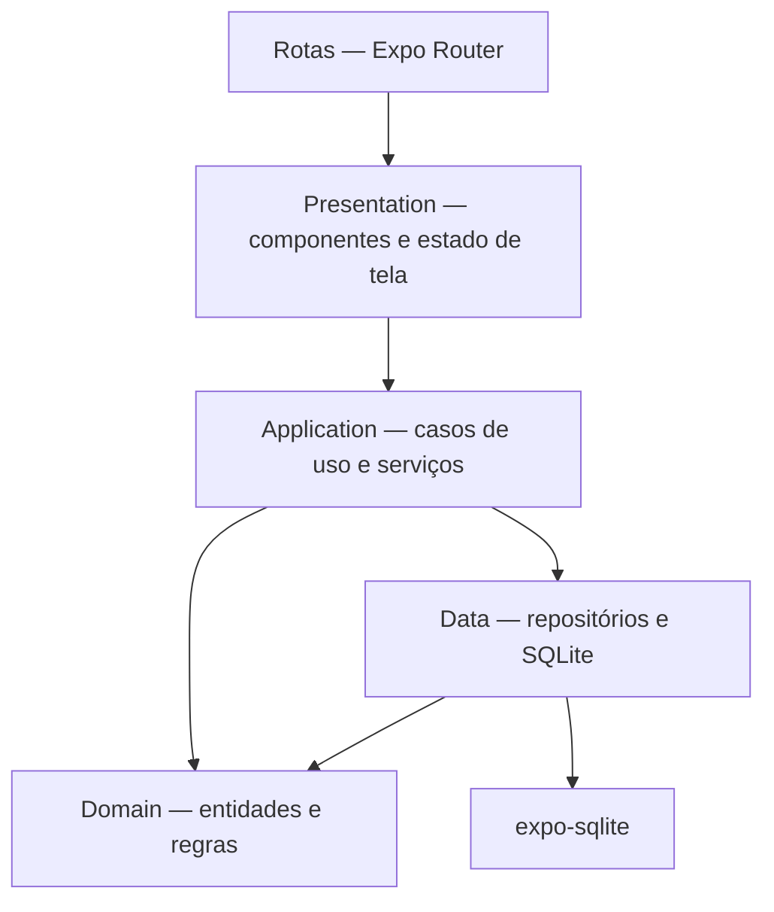

# 04 — Arquitetura

## Visão geral

Nexum será desenvolvido em **React Native com Expo e TypeScript**, usando o **Expo Go** durante o desenvolvimento inicial. A arquitetura em camadas é inspirada em Clean Architecture, simplificada para um aplicativo single-user, offline e mantido por uma única pessoa.



| Camada | Responsabilidade |
|---|---|
| **Routes** | Arquivos do Expo Router. Compõem telas, parâmetros e layouts de navegação, sem regras de negócio. |
| **Presentation** | Componentes React Native, formulários, feedback visual e stores de estado da interface. Não executa SQL. |
| **Application** | Casos de uso e serviços que orquestram operações envolvendo uma ou mais entidades. |
| **Domain** | Entidades, tipos e regras de negócio em TypeScript puro, sem dependências de React Native, Expo ou SQLite. |
| **Data** | Repositórios, mapeadores, migrations e acesso ao banco por `expo-sqlite`. |

Essa separação mantém as regras de negócio testáveis e permite trocar a persistência ou adicionar sincronização futura sem reescrever a interface.

## Stack técnica

| Área | Escolha |
|---|---|
| Framework mobile | React Native gerenciado pelo Expo |
| Linguagem | TypeScript em modo estrito |
| Ambiente inicial | Expo Go |
| Navegação | Expo Router |
| Persistência | `expo-sqlite` |
| Estado de UI | Zustand, com stores pequenas por contexto |
| Testes | Jest, `jest-expo` e React Native Testing Library |
| Build Android | EAS Build |

As versões exatas serão definidas quando o projeto for inicializado, sempre usando versões compatíveis com o Expo SDK adotado. Dependências do Expo devem ser instaladas pelo comando recomendado pelo Expo para evitar incompatibilidades.

## Limite de compatibilidade com Expo Go

Durante o MVP:

- só podem ser adotadas bibliotecas incluídas no Expo SDK ou implementadas apenas em JavaScript/TypeScript;
- não haverá edição manual de código nativo nem manutenção das pastas `android/` e `ios/`;
- toda nova dependência deve ser verificada quanto à compatibilidade com o Expo Go antes de entrar no projeto;
- se uma necessidade futura exigir código nativo ausente no Expo Go, a migração para um development build deverá ser registrada como nova decisão arquitetural.

O Expo Go é o cliente de desenvolvimento, não o artefato distribuído ao usuário. Builds instaláveis e de produção serão gerados com EAS Build.

## Organização planejada de pastas

```text
src/
├── app/                         # somente rotas e layouts do Expo Router
│   ├── _layout.tsx
│   ├── index.tsx
│   ├── people/
│   └── loans/
├── domain/
│   ├── entities/
│   │   ├── person.ts
│   │   ├── loan.ts
│   │   └── payment.ts
│   └── value-objects/
│       └── money.ts
├── application/
│   ├── use-cases/
│   │   ├── people/
│   │   ├── loans/
│   │   └── payments/
│   └── services/
│       └── outstanding-balance-service.ts
├── data/
│   ├── database/
│   │   ├── connection.ts
│   │   ├── migrations/
│   │   └── schema.ts
│   ├── mappers/
│   └── repositories/
├── presentation/
│   ├── features/
│   │   ├── home/
│   │   ├── people/
│   │   ├── loans/
│   │   └── payments/
│   ├── components/
│   ├── hooks/
│   ├── stores/
│   └── theme/
└── shared/
    ├── errors/
    ├── formatters/
    └── utils/
```

Os nomes são um direcionamento, não arquivos a serem criados antecipadamente. `src/app/` permanece reservado a rotas; componentes e lógica reutilizável ficam fora dele.

## Navegação

O Expo Router será usado por oferecer roteamento baseado em arquivos e integração direta com projetos Expo. Os arquivos de rota devem permanecer finos: recebem parâmetros, conectam dependências e renderizam componentes da camada Presentation.

A navegação principal será composta por quatro abas persistentes no rodapé:

| Aba | Arquivo de rota | Caminho |
|---|---|---|
| Início | `src/app/(tabs)/index.tsx` | `/` |
| Pessoas | `src/app/(tabs)/pessoas.tsx` | `/pessoas` |
| Ativos | `src/app/(tabs)/ativos.tsx` | `/ativos` |
| Quitados | `src/app/(tabs)/quitados.tsx` | `/quitados` |

O layout `src/app/(tabs)/_layout.tsx` registra essas quatro rotas no componente `Tabs` do Expo Router e conecta o componente visual do footer. O nome do grupo `(tabs)` organiza os arquivos, mas não faz parte do caminho público.

Ao pressionar um item do footer, o navegador de abas seleciona a rota registrada com o mesmo nome. Por exemplo, o item **Pessoas** seleciona a rota `pessoas`, que corresponde ao arquivo `pessoas.tsx` e ao caminho `/pessoas`. O Expo Router então renderiza esse arquivo dentro do layout `(tabs)` e mantém o footer visível.

Cada arquivo de rota apenas renderiza a screen correspondente da camada Presentation. A aparência do footer fica em `src/presentation/components/navigation/footer-navigator.tsx`; ela não define regras de negócio nem o conteúdo das telas.

Telas secundárias, como detalhe e formulário, usam navegação em pilha sobre o layout das abas. Ao abrir uma dessas telas, ela é adicionada à pilha; ao voltar, o usuário retorna para a aba de origem. As quatro abas não devem empilhar cópias umas das outras quando o usuário alternar entre elas.

## Gerenciamento de estado

Zustand será usado apenas para estado compartilhado de interface e coordenação assíncrona entre telas. Estado local de formulário ou componente continua em hooks locais quando não precisa ser compartilhado.

Regras:

- uma store pequena por contexto de negócio, evitando uma store global monolítica;
- stores chamam casos de uso, nunca executam SQL diretamente;
- dados derivados, como saldo devedor, continuam sob responsabilidade do domínio/aplicação;
- acesso por seletores para limitar renderizações desnecessárias;
- dependências são montadas em um ponto de composição, sem service locator acessível pelo domínio.

## Persistência

`expo-sqlite` será a persistência local porque funciona no Expo Go, mantém o banco entre reinicializações e oferece transações e integridade relacional adequadas ao domínio.

As operações compostas — pagamento com atualização de status e exclusões em cascata — devem ser atômicas. Foreign keys serão habilitadas na inicialização, migrations serão versionadas e detalhes do schema ficam em `09-banco.md`.

## Padrões utilizados

| Padrão | Aplicação |
|---|---|
| Repository | Isola os casos de uso dos detalhes de SQLite. |
| Use Case | Mantém cada ação de negócio explícita e testável. |
| Value Object `Money` | Centraliza valores inteiros em centavos e impede operações inválidas. |
| Result discriminado | Representa sucesso e falhas esperadas sem exceptions genéricas na UI. |
| Mapper | Converte linhas do banco em entidades de domínio. |
| Migrations versionadas | Permitem evoluir o schema sem perda de dados. |

## Regras de dependência

1. Domain não importa React, React Native, Expo, Zustand nem `expo-sqlite`.
2. Application depende de Domain e de contratos mínimos necessários aos casos de uso.
3. Data implementa a persistência e conhece Application/Domain, nunca Presentation.
4. Presentation conhece casos de uso e tipos de Domain, mas não conhece SQL.
5. Routes conhecem navegação e Presentation; não contêm regras de negócio.

## Referências oficiais

- [Expo Router](https://docs.expo.dev/router/introduction/)
- [Compatibilidade e limites do Expo Go](https://docs.expo.dev/develop/development-builds/introduction/)
- [`expo-sqlite`](https://docs.expo.dev/versions/latest/sdk/sqlite/)
- [TypeScript no Expo](https://docs.expo.dev/guides/typescript/)
- [Testes unitários no Expo](https://docs.expo.dev/develop/unit-testing/)
- [EAS Build](https://docs.expo.dev/build/)
