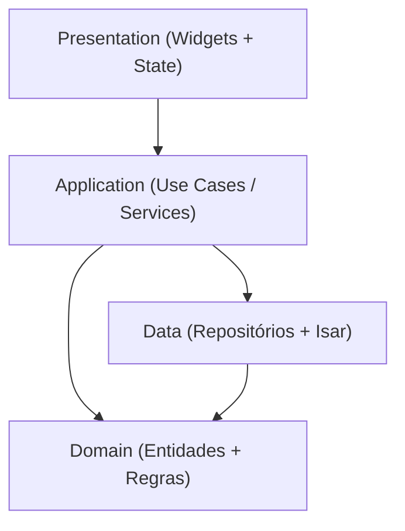

# 04 — Arquitetura

## Visão geral

Nexum adota uma arquitetura em camadas, inspirada em **Clean Architecture**, mas deliberadamente **simplificada** para o tamanho e a natureza do projeto (app single-user, offline, mantido por uma única pessoa). O objetivo é ter separação de responsabilidades suficiente para permitir evolução (ex.: sincronização em nuvem futura) sem o overhead de um projeto enterprise.



### Camadas

| Camada | Responsabilidade |
|---|---|
| **Presentation** | Widgets Flutter, telas, navegação, gerenciamento de estado da UI. Não conhece detalhes de persistência. |
| **Application** | Casos de uso (ex.: `RegisterPayment`, `PayoffLoan`). Orquestra regras de negócio que envolvem mais de uma entidade. |
| **Domain** | Entidades puras (Pessoa, Emprestimo, Pagamento) e regras de negócio intrínsecas a elas (ex.: cálculo de saldo devedor). Sem dependência de Flutter ou de Isar. |
| **Data** | Repositórios que implementam o acesso ao banco local (Isar), convertendo entre modelos de persistência e entidades de domínio. |

Essa separação permite, por exemplo, trocar Isar por outro mecanismo de persistência (ou adicionar sincronização remota) sem alterar a camada de apresentação ou as regras de domínio.

---

## Organização de pastas Flutter

## Organização de pastas Flutter

```text
lib/
├── main.dart
├── app/
│   ├── app.dart                # MaterialApp, tema, rotas
│   └── theme/
│       ├── colors.dart
│       ├── typography.dart
│       └── spacing.dart
├── domain/
│   ├── entities/
│   │   ├── person.dart
│   │   ├── loan.dart
│   │   └── payment.dart
│   └── value_objects/
│       └── money.dart          # tipo Money para valores em centavos
├── application/
│   ├── usecases/
│   │   ├── person/
│   │   │   ├── create_person.dart
│   │   │   ├── update_person.dart
│   │   │   └── delete_person.dart
│   │   ├── loan/
│   │   │   ├── create_loan.dart
│   │   │   ├── update_loan.dart
│   │   │   └── delete_loan.dart
│   │   └── payment/
│   │       ├── register_payment.dart
│   │       ├── settle_loan.dart
│   │       └── delete_payment.dart
│   └── services/
│       └── outstanding_balance_service.dart
├── data/
│   ├── models/                 # modelos anotados @Collection (Isar)
│   │   ├── person_model.dart
│   │   ├── loan_model.dart
│   │   └── payment_model.dart
│   ├── repositories/
│   │   ├── person_repository.dart
│   │   ├── loan_repository.dart
│   │   └── payment_repository.dart
│   └── datasources/
│       └── isar_datasource.dart
├── presentation/
│   ├── home/
│   │   ├── home_screen.dart
│   │   └── home_controller.dart
│   ├── people/
│   │   ├── people_list_screen.dart
│   │   ├── person_details_screen.dart
│   │   ├── person_form_screen.dart
│   │   └── people_controller.dart
│   ├── loans/
│   │   ├── loan_details_screen.dart
│   │   ├── loan_form_screen.dart
│   │   └── loans_controller.dart
│   ├── payments/
│   │   ├── payment_form_screen.dart
│   │   └── payments_controller.dart
│   └── shared/
│       ├── widgets/
│       └── formatters/         # formatação de moeda e data
└── core/
    ├── errors/
    ├── extensions/
    └── utils/
```

### Justificativa da organização

- Pastas por **camada primeiro, feature depois** (`domain/`, `application/`, `data/`, `presentation/`) tornam explícito o limite arquitetural.
- Dentro de `presentation/`, a subdivisão é por **feature** (people, loans, payments), o que é mais natural para navegação de um app pequeno do que separar por tipo de widget.
- `core/` concentra utilitários transversais (formatação, extensões, tratamento de erro) para evitar duplicação.

---

## Gerenciamento de estado

**Riverpod** (`flutter_riverpod`).

### Justificativa

- É a opção com melhor equilíbrio entre simplicidade de uso e testabilidade para um projeto solo.
- Elimina a necessidade de `BuildContext` para acessar estado, o que simplifica a camada de aplicação e os testes.
- Facilita a injeção de repositórios (ex.: `personRepositoryProvider`) sem boilerplate de um service locator manual.
- Escala bem caso o projeto cresça (ex.: adicionar cache, sincronização) sem precisar de migração de arquitetura.
- Evita a complexidade adicional de soluções como Bloc (mais verboso) para um app com regras de UI relativamente simples.

### Padrão de uso

- **Providers de repositório**: expõem instâncias dos repositórios (camada Data).
- **Providers de caso de uso**: expõem os use cases da camada Application.
- **StateNotifierProvider / AsyncNotifierProvider**: gerenciam o estado de cada tela (ex.: lista de pessoas, detalhe de empréstimo), consumindo os use cases.
- Widgets são "burros": apenas leem providers (`ref.watch`) e disparam ações (`ref.read(...).someAction()`).

---

## Persistência

**Isar** é o banco local recomendado.

### Justificativa (Isar vs. SQLite puro)

| Critério | Isar | Isar (sqflite) |
|---|---|---|
| Produtividade | Modelos Dart anotados, sem SQL manual | Exige escrever/manter SQL e migrations manuais |
| Performance | Otimizado para Flutter, leitura muito rápida | Bom, mas overhead de parsing de queries |
| Consultas reativas | Suporte nativo a *watchers* (streams) | Requer implementação manual de reatividade |
| Relacionamentos | Links/backlinks tipados | Chaves estrangeiras manuais via SQL |
| Curva de aprendizado | Baixa para quem já usa Dart | Exige conhecimento de SQL |

Como o projeto é mantido por uma única pessoa e prioriza velocidade de desenvolvimento sem sacrificar robustez, Isar é a escolha mais alinhada à filosofia de simplicidade do Nexum. Detalhes de schema em `09-banco.md`.

---

## Padrões utilizados

| Padrão | Onde é aplicado | Motivo |
|---|---|---|
| Repository Pattern | Camada Data | Isola a camada de domínio/aplicação dos detalhes do Isar. |
| Use Case (Command) | Camada Application | Cada ação de negócio é uma classe/função isolada, testável individualmente. |
| Value Object (`Money`) | Domain | Evita erros de ponto flutuante e centraliza formatação/validação de valores monetários. |
| Result/Either para erros | Application → Presentation | Evita exceptions "soltas" chegando à UI; erros de negócio (ex.: pagamento maior que saldo) são valores, não exceptions. |
| Provider/DI via Riverpod | Toda a árvore | Desacopla criação de dependências do uso, facilita testes. |

## Justificativas gerais da arquitetura

1. **Separação em camadas, mas sem excesso de abstração**: não há interfaces abstratas "por precaução" onde só existirá uma implementação (ex.: não haverá `IPessoaRepository` abstrato se só existir Isar) — evita boilerplate desnecessário em projeto solo. Abstrações serão introduzidas apenas quando o benefício for concreto (ex.: ao introduzir sincronização).
2. **Domain sem dependência de Flutter/Isar**: garante que as regras de negócio (cálculo de saldo, validações) possam ser testadas em testes puramente unitários, rápidos, sem necessidade de widget test ou banco real.
3. **Preparação para o futuro sem construir para o futuro**: a arquitetura já separa persistência do domínio, então adicionar sincronização em nuvem no futuro significa criar um novo `SyncRepository`/`RemoteDataSource`, sem tocar em regras de negócio ou UI.