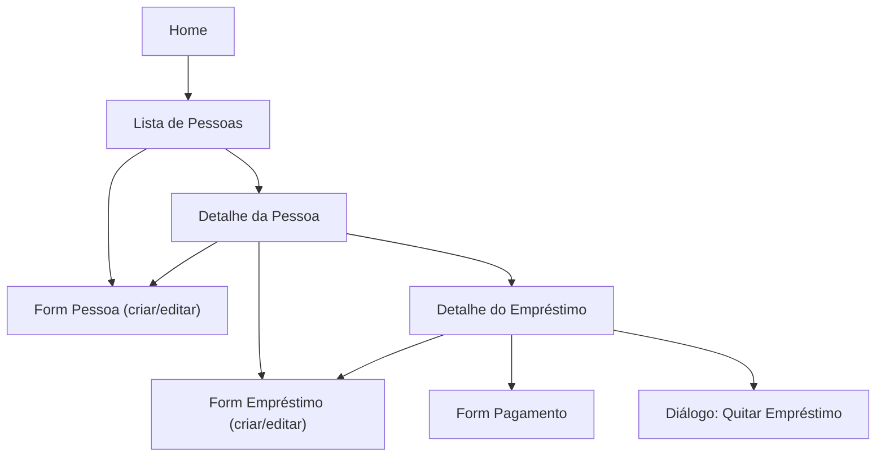

# 08 — Wireframes

Wireframes de baixa fidelidade, representando estrutura e hierarquia de informação de cada tela. Não representam estilo visual final (ver `10-guidelines.md`).

---

## Mapa de navegação



---

## Tela: Home

```
┌───────────────────────────────────┐
│  Nexum                            │
│                                    │
│  Total emprestado (ativo)         │
│  R$ 3.450,00                      │
│                                    │
│  Pessoas devedoras: 5             │
│                                    │
│  ── Empréstimos recentes ──────── │
│  ● João Silva      R$ 500,00      │
│  ● Maria Souza      R$ 200,00      │
│  ● Pedro Lima       R$ 1.000,00    │
│                                    │
│                                    │
│              [ + ]  <- novo empr. │
└───────────────────────────────────┘
│  Home   Pessoas   Ativos  Quitados│  <- nav inferior (opcional)
└───────────────────────────────────┘
```

---

## Tela: Lista de Pessoas

```
┌───────────────────────────────────┐
│  Pessoas                    [🔍]  │
│  ┌───────────────────────────────┐│
│  │ 🔍 Pesquisar pessoa...        ││
│  └───────────────────────────────┘│
│                                    │
│  João Silva                       │
│    Saldo devedor: R$ 500,00       │
│  ───────────────────────────────  │
│  Maria Souza                      │
│    Saldo devedor: R$ 0,00         │
│  ───────────────────────────────  │
│  Pedro Lima                       │
│    Saldo devedor: R$ 1.000,00     │
│  ───────────────────────────────  │
│                                    │
│                          [ + ]    │
└───────────────────────────────────┘
```

**Estado vazio:**

```
┌───────────────────────────────────┐
│  Pessoas                          │
│  ┌───────────────────────────────┐│
│  │ 🔍 Pesquisar pessoa...        ││
│  └───────────────────────────────┘│
│                                    │
│        (ilustração simples)       │
│    Nenhuma pessoa cadastrada      │
│  Toque em "+" para começar        │
│                                    │
│                          [ + ]    │
└───────────────────────────────────┘
```

---

## Tela: Form Pessoa (criar/editar)

```
┌───────────────────────────────────┐
│  ←  Nova Pessoa          [Salvar] │
│                                    │
│  Nome *                           │
│  ┌───────────────────────────────┐│
│  │                               ││
│  └───────────────────────────────┘│
│                                    │
│  Telefone                         │
│  ┌───────────────────────────────┐│
│  │                               ││
│  └───────────────────────────────┘│
│                                    │
│  Observação                       │
│  ┌───────────────────────────────┐│
│  │                               ││
│  │                               ││
│  └───────────────────────────────┘│
│                                    │
└───────────────────────────────────┘
```

---

## Tela: Detalhe da Pessoa

```
┌───────────────────────────────────┐
│  ←  João Silva          [✎] [⋮]  │
│                                    │
│  Saldo devedor total              │
│  R$ 500,00                        │
│                                    │
│  [ Ativos ]   Quitados            │  <- abas
│  ─────────────────────────────    │
│  Empréstimo — 10/06/2026           │
│    Valor: R$ 700,00               │
│    Saldo: R$ 500,00               │
│  ─────────────────────────────    │
│                                    │
│                                    │
│              [ + Novo Empréstimo ]│
└───────────────────────────────────┘
```

---

## Tela: Form Empréstimo (criar/editar)

```
┌───────────────────────────────────┐
│  ←  Novo Empréstimo      [Salvar] │
│                                    │
│  Pessoa                           │
│  João Silva                       │
│                                    │
│  Valor *                          │
│  ┌───────────────────────────────┐│
│  │ R$ 0,00                       ││
│  └───────────────────────────────┘│
│  (somente leitura se já houver    │
│   pagamentos registrados)         │
│                                    │
│  Data *                           │
│  ┌───────────────────────────────┐│
│  │ 06/07/2026              [📅] ││
│  └───────────────────────────────┘│
│                                    │
│  Descrição                        │
│  ┌───────────────────────────────┐│
│  │                               ││
│  └───────────────────────────────┘│
│                                    │
└───────────────────────────────────┘
```

---

## Tela: Detalhe do Empréstimo

```
┌───────────────────────────────────┐
│  ←  Empréstimo            [✎] [⋮]│
│                                    │
│  João Silva                       │
│  Concedido em 10/06/2026           │
│                                    │
│  Valor original     R$ 700,00     │
│  Saldo devedor       R$ 500,00    │
│  Status              ● Ativo      │
│                                    │
│  [ Registrar Pagamento ] [Quitar] │
│                                    │
│  ── Histórico de pagamentos ───── │
│  20/06/2026   R$ 200,00      [🗑] │
│                                    │
│                                    │
└───────────────────────────────────┘
```

**Estado quitado:**

```
┌───────────────────────────────────┐
│  ←  Empréstimo            [✎] [⋮]│
│                                    │
│  João Silva                       │
│  Concedido em 10/06/2026           │
│                                    │
│  Valor original     R$ 700,00     │
│  Saldo devedor       R$ 0,00      │
│  Status              ✔ Quitado    │
│                                    │
│  ── Histórico de pagamentos ───── │
│  25/06/2026   R$ 500,00      [🗑] │
│  20/06/2026   R$ 200,00      [🗑] │
│                                    │
└───────────────────────────────────┘
```

---

## Tela: Form Pagamento

```
┌───────────────────────────────────┐
│  ←  Registrar Pagamento  [Salvar] │
│                                    │
│  Saldo devedor atual: R$ 500,00   │
│                                    │
│  Valor *                          │
│  ┌───────────────────────────────┐│
│  │ R$ 0,00                       ││
│  └───────────────────────────────┘│
│                                    │
│  Data *                           │
│  ┌───────────────────────────────┐│
│  │ 06/07/2026              [📅] ││
│  └───────────────────────────────┘│
│                                    │
│  Observação                       │
│  ┌───────────────────────────────┐│
│  │                               ││
│  └───────────────────────────────┘│
│                                    │
└───────────────────────────────────┘
```

---

## Diálogo: Quitar Empréstimo

```
┌───────────────────────────────────┐
│   Quitar empréstimo?              │
│                                    │
│   Será registrado um pagamento    │
│   de R$ 500,00, zerando o saldo   │
│   devedor deste empréstimo.       │
│                                    │
│           [Cancelar]  [Confirmar] │
└───────────────────────────────────┘
```

## Diálogo: Excluir Pessoa (com empréstimos ativos)

```
┌───────────────────────────────────┐
│   Excluir João Silva?             │
│                                    │
│   Esta pessoa possui R$ 500,00    │
│   em empréstimos ativos. Todos    │
│   os dados serão removidos        │
│   permanentemente.                │
│                                    │
│           [Cancelar]  [Excluir]   │
└───────────────────────────────────┘
```
